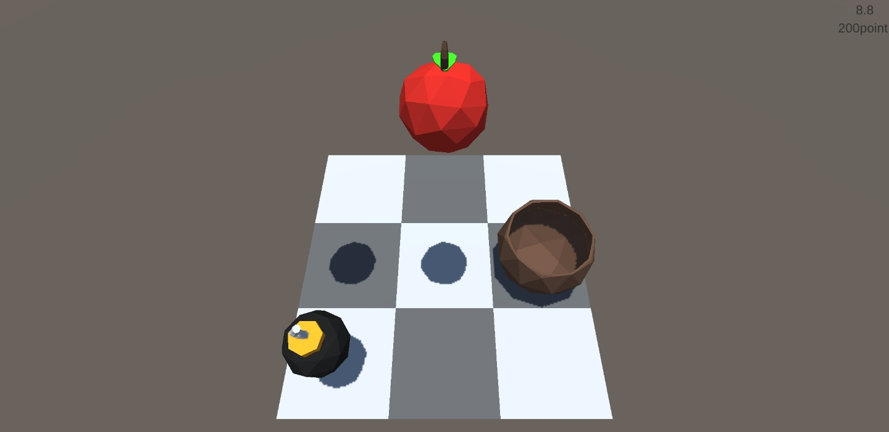

# AppleCatch_Game
 
## 기획

- 주제 : 떨어지는 사과를 바구니로 받는 게임
- 내용 :
    - 3X3 구역으로 분할되어 있는 판에 사과가 떨어진다
    - 판을 탭하면 그 구역으로 바구니가 이동한다
    - 폭탄도 떨어지며 폭탄을 받으면 점수가 줄어든다
- 리소스 :
    1. 오브젝트 : 사과 폭탄 바구니 무대 UI
    2. 컨트롤러 스크립트 : 사과 컨트롤러, 폭탄 컨트롤러, 바구니 컨트롤러
    3. 제네레이터 스크립트 : 아이템 제네레이터
    4. 감독 스크립트 : UI용 감독 스크립트
    5. 흐름 : 컨트롤러 -> 제네레이터 -> 감독 스크립트

## 결과

- 버전1  
    